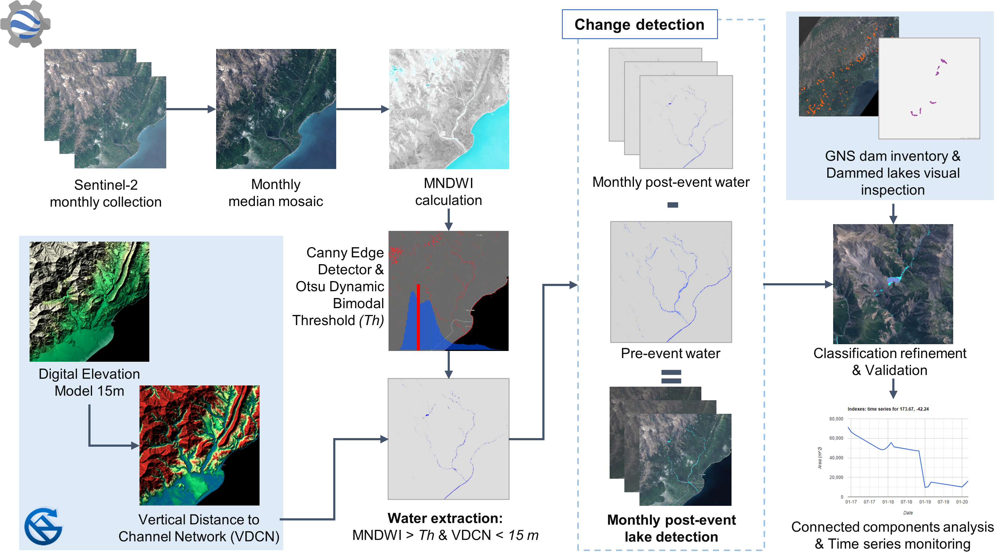
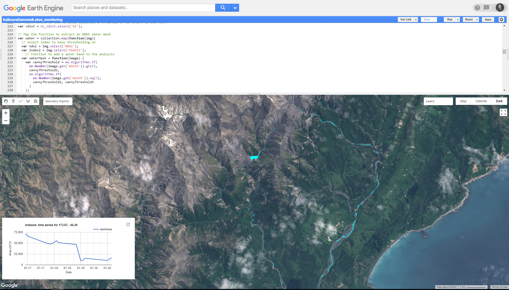

# Landslide dammed-lakes detection and monitoring after the Kaikoura earthquake in New Zealand

This repository centralizes the main processing steps to detect and monitor landslide-dammed lakes in NZ. It is meant to accompany a journal article, currently under review in STOTEN. This study is part of the ÖAW-funded [RiCoLa project](https://landslides-and-rivers.sbg.ac.at/).

For a brief introduction to the study, please refer to:

> Abad, L., Hölbling, D., Spiekermann, R., Dabiri, Z., Prasicek, G., and Argentin, A.-L.: Mapping and monitoring of landslide-dammed lakes using Sentinel-2 time series - a case study after the 2016 Kaikōura Earthquake in New Zealand, EGU General Assembly 2020, Online, 4–8 May 2020, EGU2020-572, https://doi.org/10.5194/egusphere-egu2020-572, 2019

The objective of the study is to automatically map the landslide-dammed lakes caused by the 2016 Kaikōura earthquake in New Zealand and to monitor their evolution at different points in time, using time series of Sentinel-2 imagery and GEE. 

The figure below shows an overview of the methodology followed:

The main analysis was performed on Google Earth Engine (GEE), and its corresponding repository can be found [here](https://code.earthengine.google.com/?accept_repo=users/loreabad6/KaikouraDammedLakes_public). To access the code files, you will need to have a GEE account.

If you would only like to see the main code, without a GEE account, please [click here](https://code.earthengine.google.com/354be2242944d820090df1eb4c68dbe9?noload=true)

Some steps were done outside GEE including:

- [RSAGA generation of vertical distance to channel network layer](pre_processing/rsaga/vdcn_procedure.md)

The resulting layer was then ingested into GEE. 

A preview of how the GEE editor would look like with our results is shown below:

### Acknowledgements:
This research is supported by the Austrian Academy of Sciences (ÖAW) through the project RiCoLa (Detection and analysis of landslide-induced river course changes and lake formation) and by the New Zealand Ministry of Business, Innovation and Employment research program “Smarter Targeting of Erosion Control (STEC)” (Contract C09X1804).

### Further dissemination: 

A preview of the upcoming article can be seen on [this poster](https://docs.google.com/presentation/d/1FVrxwwuBUsb69OKYbyssNDphket-6V4nhlK1OuXVDdw/edit?usp=sharing) submitted to the [Geo For Good 2020](https://earthoutreachonair.withgoogle.com/events/geoforgood20). Also, a [lightning talk](https://qrgo.page.link/izjEp) on the topic will take place as part of the [Public Sector Meetup](https://docs.google.com/document/d/1HW-FiUbIzi52SPjKWLw_JuZNtv-wRUSfDI94Qk-P_AE/edit) during the summit. *Q&A: October 21st, 16h30 PM - CEST*. 