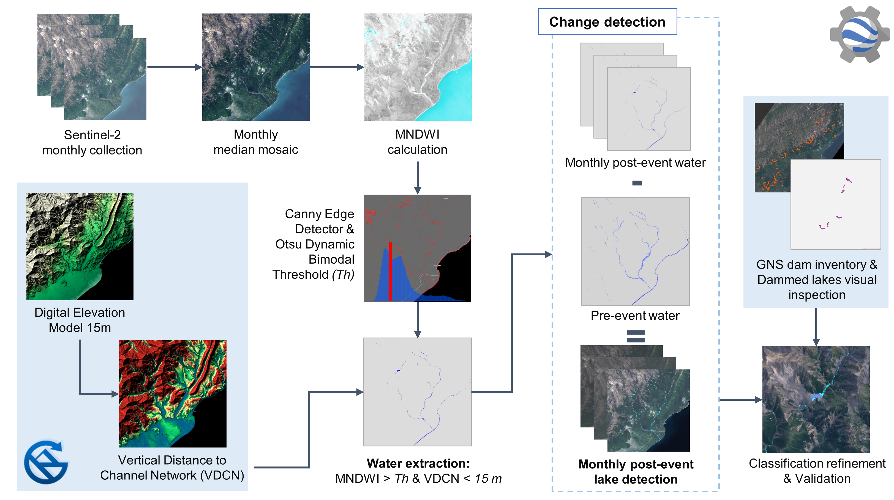

# Landslide dammed-lakes detection and monitoring after the Kaikoura earthquake in New Zealand

This repository centralizes the main processing steps to detect and monitor landslide-dammed lakes in NZ. It is meant to accompany a journal article, currently under review. 

For a brief introduction to the study, please refere to:

> Abad, L., Hölbling, D., Spiekermann, R., Dabiri, Z., Prasicek, G., and Argentin, A.-L.: Mapping and monitoring of landslide-dammed lakes using Sentinel-2 time series - a case study after the 2016 Kaikōura Earthquake in New Zealand, EGU General Assembly 2020, Online, 4–8 May 2020, EGU2020-572, https://doi.org/10.5194/egusphere-egu2020-572, 2019

The objective of the study is to automatically map the landslide-dammed lakes caused by the 2016 Kaikōura earthquake in New Zealand and to monitor their evolution at different points in time, using time series of Sentinel-2 imagery and GEE. 

The figure below shows an overview of the methodology followed:

The main analysis was performed on Google Earth Engine (GEE), and its corresponding code can be found [here](https://code.earthengine.google.com/cf8ae7f2029f2eabda0439bf7ecb0eb9).

Some steps were done outside GEE including:

- [QGIS pre-processing of pre-event imagery](pre_processing/QGISprocess.md)
- [RSAGA generation of vertical distance to channel network layer](pre_processing/rsaga/vdcn_procedure.md)

Both resulting layers are then ingested into GEE. 

The rest of the analysis is explained on the [main GEE code](https://code.earthengine.google.com/cf8ae7f2029f2eabda0439bf7ecb0eb9).