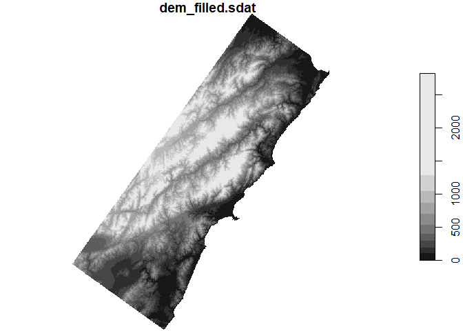
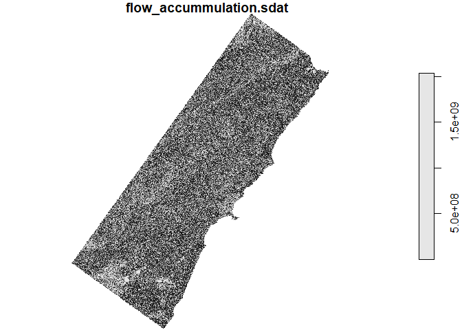
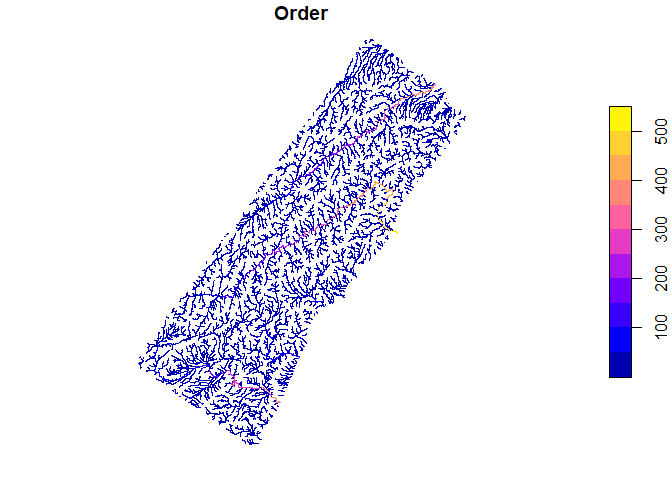
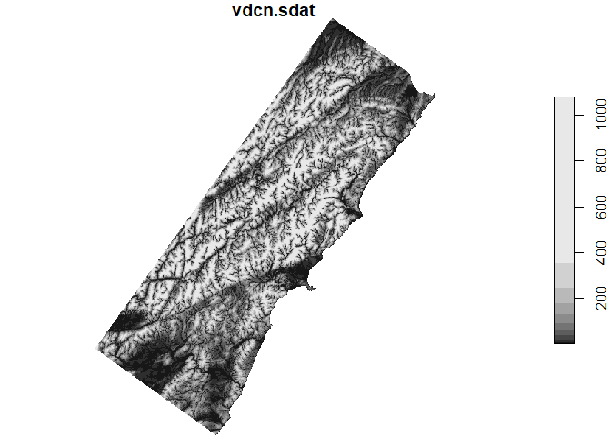

Calculating vertical distance from drainage
===========================================

For water mapping purposes, topographic properties of the study area are
well received to remove false positives. These properties are derived
from Digital Elevation Models (DEM). One important derived property is
the vertical distance from drainage, which, depending on the software,
can be computed with different algorithms. One of them is the Height
above the Nearest Drainage (HAND), computed in TauDEM or Hydroshare.
Another option is the Vertical Distance to Channel Network computed in
SAGA. Since the `RSAGA` package allows an easy bridge between R and
SAGA, I will focus on this last algorithm.

Stepwise approach:
------------------

### 1. Load data into R

Since SAGA works with data on disk, we will load the original data as a
raster object, and then save it as a SAGA `.sgrd` file.

    library(raster)
    dem <- raster('../../NZ_DEM_15m/nzdem_nztm_nzgd49_kaikoura.tif') 

    writeRaster(dem, filename = 'dem.sgrd', format = 'SAGA', overwrite = T, NAflag = 0)

### 2. Call SAGA environment

    library(RSAGA)
    env <- rsaga.env()

### 3. Fill voids on DEM

    rsaga.fill.sinks(in.dem = "dem.sgrd", out.dem = "dem_filled", method = "wang.liu.2006", env = env)

Plot the data with stars:

    library(stars)
    dem_filled <- read_stars('dem_filled.sdat', proxy = T)
    plot(dem_filled)

### 4. Compute flow accumulation

    rsaga.get.modules('ta_hydrology', env = env)
    rsaga.get.usage('ta_hydrology', 0, env = env)
    rsaga.geoprocessor(
      'ta_hydrology', 0, 
      list(ELEVATION='dem_filled.sgrd', FLOW='flow_accummulation', METHOD=0),
      env = env
    )

    library(stars)
    flow_accummulation <- read_stars('flow_accummulation.sdat', proxy = T)
    plot(flow_accummulation)

### 5. Calculate channel network

    rsaga.get.modules('ta_channels', env = env)
    rsaga.get.usage('ta_channels', 0, env = env)
    rsaga.geoprocessor(
      'ta_channels', 0, 
      list(ELEVATION='dem_filled.sgrd', INIT_GRID='flow_accummulation.sgrd', INIT_VALUE=1000000, CHNLNTWRK="channel_net.sdat",CHNLROUTE="route.sdat",SHAPES='channel_net_shp.shp'),
      env = env
    )

    library(sf)
    channel_net <- st_read('channel_net_shp.shp')

    ## Reading layer `channel_net_shp' from data source `D:\RiCoLa\NewZealand\NZ\pre_processing\rsaga\channel_net_shp.shp' using driver `ESRI Shapefile'
    ## Simple feature collection with 3989 features and 3 fields
    ## geometry type:  LINESTRING
    ## dimension:      XY
    ## bbox:           xmin: 1574618 ymin: 5247052 xmax: 1704262 ymax: 5408168
    ## CRS:            NA

    plot(channel_net['Order'])

### 6. Calculate vertical distance to channel network

    rsaga.get.usage('ta_channels', 3, env = env)
    rsaga.geoprocessor(
      'ta_channels', 3, 
      list(ELEVATION='dem_filled.sgrd', CHANNELS='channel_net.sgrd', DISTANCE='vdcn'),
      env = env
    )

    vdcn <- read_stars('vdcn.sdat')
    vdcn <- st_set_crs(vdcn, value = st_crs(dem))
    plot(vdcn)

    write_stars(vdcn, 'vdcn.tiff')
